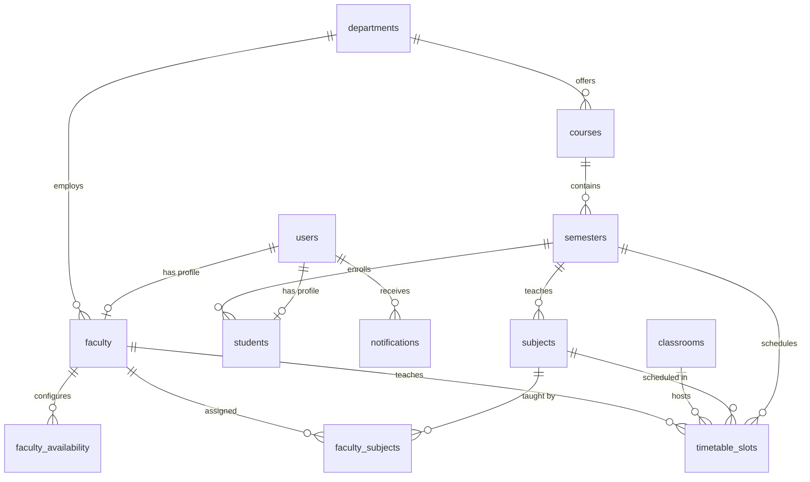

# Database Schema ER Diagram

## Tables & Fields Descriptions

### 1. `users`
- `id` (INT, PK)
- `full_name` (VARCHAR)
- `email` (VARCHAR, Unique)
- `password_hash` (VARCHAR)
- `role` (VARCHAR: admin | faculty | student)
- `is_active` (BOOLEAN)

### 2. `departments`
- `id` (INT, PK)
- `name` (VARCHAR)
- `code` (VARCHAR, Unique)
- `head_faculty_id` (INT, FK)

### 3. `courses`
- `id` (INT, PK)
- `name` (VARCHAR)
- `code` (VARCHAR, Unique)
- `department_id` (INT, FK)
- `duration_years` (INT)

### 4. `semesters`
- `id` (INT, PK)
- `number` (INT)
- `course_id` (INT, FK)
- `academic_year` (VARCHAR)
- `sections` (VARCHAR: e.g. "A,B")

### 5. `subjects`
- `id` (INT, PK)
- `name` (VARCHAR)
- `code` (VARCHAR)
- `semester_id` (INT, FK)
- `hours_per_week` (INT)
- `credit_hours` (INT)
- `is_lab` (BOOLEAN)
- `lab_hours` (INT)

### 6. `classrooms`
- `id` (INT, PK)
- `name` (VARCHAR)
- `building` (VARCHAR)
- `capacity` (INT)
- `is_lab` (BOOLEAN)
- `lab_type` (VARCHAR)

### 7. `faculty`
- `id` (INT, PK)
- `user_id` (INT, FK)
- `employee_id` (VARCHAR, Unique)
- `department_id` (INT, FK)
- `max_hours_per_week` (INT)

### 8. `timetable_slots`
- `id` (INT, PK)
- `semester_id` (INT, FK)
- `section` (VARCHAR)
- `day_of_week` (INT: 0-4)
- `period_number` (INT: 1-8)
- `subject_id` (INT, FK)
- `faculty_id` (INT, FK)
- `classroom_id` (INT, FK)
- `slot_type` (VARCHAR: theory | lab)
